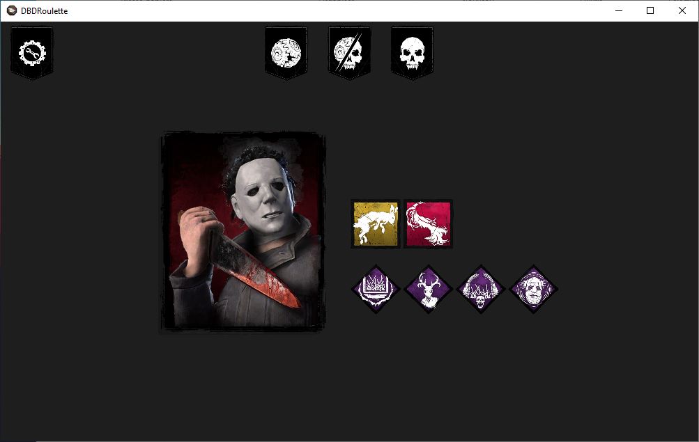
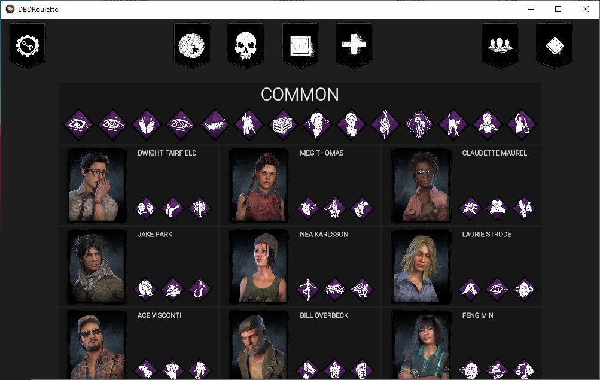
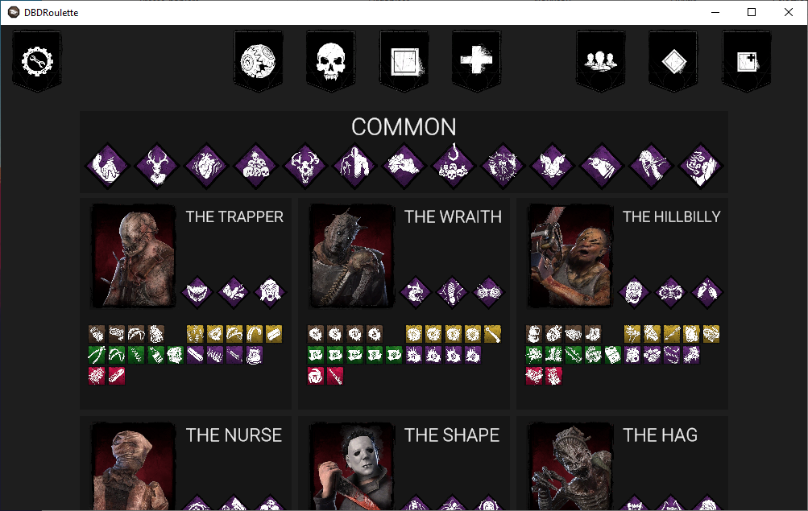
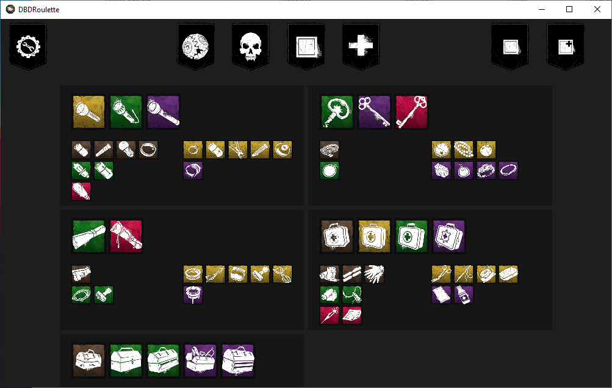
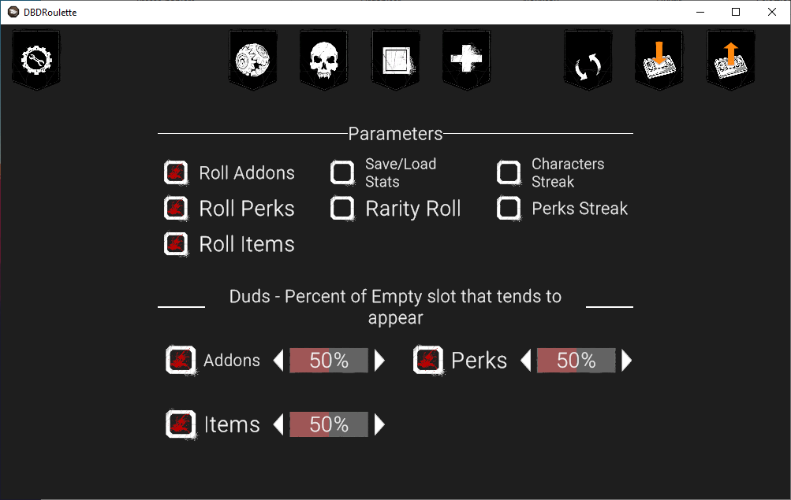
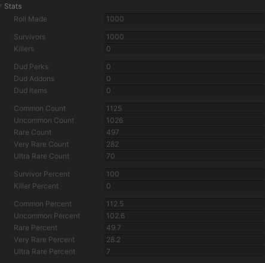
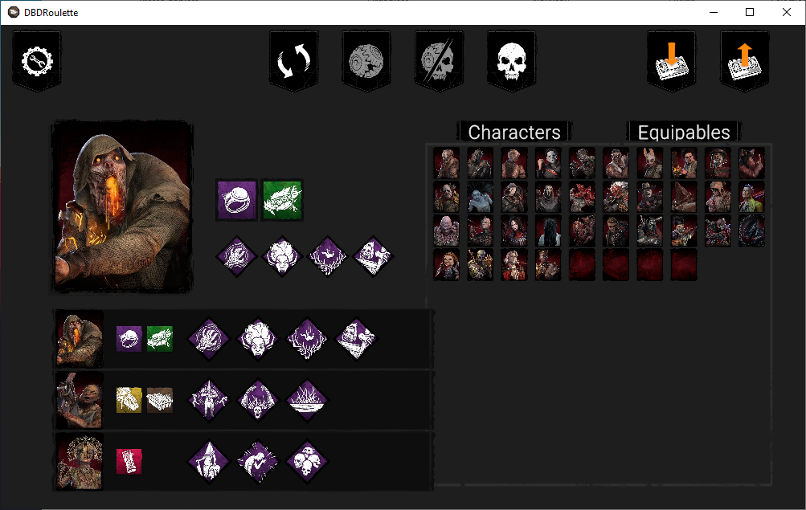
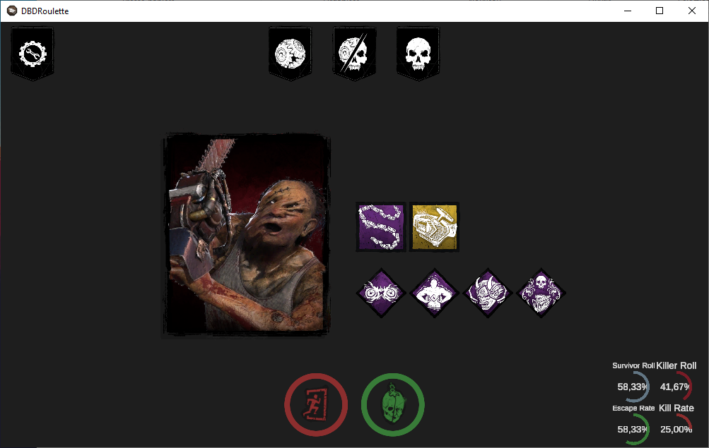

# DBD-Roulette

A simple tool made with Unity for picking randomly Character, items and addons in Dead By Daylight[^1].

[^1]: Images are obtained from the [Dead by Daylight wiki](https://deadbydaylight.wiki.gg/wiki/Dead_by_Daylight_Wiki).

### Survivors

#### Additional controls

By pressing on a character image while holding the `left Ctrl`, you can toggle all their perks.

### Killers

#### Additional controls

By pressing on a character image while holding the `left Ctrl`, you can toggle all their perks.
By pressing on a character image while holding the `left Alt`, you can toggle all their addons.

### Items

#### Additional controls

By pressing on an item image while holding the `left Ctrl`, you can toggle all item of the same family.
By pressing on an item image while holding the `left Alt`, you can toggle all their addons.

### Additional options

#### Rarity Roll

With the rarity roll enabled, the rarity of the equipable is taken into account. When rolling, you are more likely to get uncommon or common than ultra rare.

Here is an exemple out of a 1000 survivor rolls with rarity roll enabled :

#### Duds

Duds are empty slot that can appear when rolling and if the option is enabled.

#### Streak

You can enable the streak mode for characters and perks. In this mode, each element (characters or/and perks), can only appear once until the streak is ended or reset. 

#### Stats

When this option is enabled, each appearance of an element (characters, perks, addons and items) will be recorded, and you will have two new buttons to say if you won or not with the stuff you were given. Additionaly extra stat will be displayed on the main screen, and in the option while hovering an element and pressing the Left Ctrl.

## Saving

If you want to save your streak data, your options, or the stats. In the options you will have two button on the top right corner to do so.

The files will be saved in your LocalLow in a folder named LouSialae/DBDRoulette. The path will be copied to your clipboard when saving.

`C:\...\AppData\LocalLow\LouSialae\DBDRoulette`

The saves and the streaks are .json human readdable file.
The Stats data are .tsv file easily importable in spreadsheet softwares.
